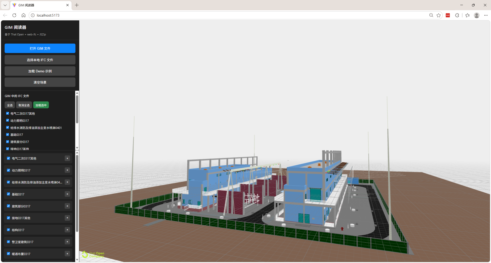

# GIM 阅读器

基于 Tauri 的 GIM（Grid Information Model，电网信息模型）文件浏览器，支持变电 IFC 浏览与线路工程地图浏览。



## 项目定位

- **Tauri 桌面 GIM 阅读器**：离线运行、portable exe、CSP 安全策略
- **支持变电 IFC 浏览**：CBM 层级树 + IFC 3D 模型 + 属性面板
- **支持线路地图浏览**：Canvas 2D 地图 + 塔位符号 + 导线折线 + 图层控制

## 技术栈

| 层 | 技术 |
|---|---|
| 桌面框架 | Tauri 2（Rust 后端 + Vite 前端） |
| 3D 渲染 | @thatopen/components (OBC) + web-ifc + Three.js |
| 压缩包解压 | libarchive.js（WebAssembly，支持 7z/ZIP/RAR） |
| 本地数据库 | rusqlite（bundled SQLite，Rust 侧管理） |
| 线路地图 | Canvas 2D + SVG（离线渲染，无地图引擎依赖） |
| 构建 | Vite + TypeScript strict |

## 核心功能

- **打开 `.gim` 文件**：自动检测 GIMPKG* 头部（GIMPKGS=变电 / GIMPKGT=线路），解压内部 7z/ZIP 数据
- **自动识别工程类型**：基于 CBM 目录大小写、IFC 文件存在性、线路信号键（ENTITYNAME / GROUPTYPE / WIRETYPE 等）
- **变电工程**：CBM 层级树 + IFC 文件选择 + 3D 模型渲染 + 构件高亮 + 属性面板
- **线路工程**：Canvas 地图 + 塔位符号 + 导线折线 + 跨越点 + 图层开关 + 树↔地图↔属性联动
- **SQLite 缓存**：首次打开解压 + 解析 + 入库；二次打开缓存命中，秒开（不读取原始 GIM）
- **工程切换清理**：dispose 旧 Fragments 模型 + 销毁线路地图 + 清空 UI + 重置状态
- **IFC 异常隔离**：单个 IFC 加载失败不阻断其他 IFC；Fragments "Malformed tile" 异常被 catch

## MVP 范围（线路工程）

- Canvas 2D 地图（等距投影，无真实底图）
- 塔位符号（圆形=直线塔，菱形=耐张塔）
- 折线导线（按类型着色：CONDUCTOR 蓝 / GROUNDWIRE 灰 / OPGW 绿）
- CROSS 跨越点（三角形，可选显示）
- 图层开关（导线 / 地线 / OPGW / 未知线 / 塔位 / 跨越点 / 标签）
- tooltip 展示塔位编号、类型、呼高、转角、坐标、FAM/DEV 命中状态

## GIM 文件格式

`.gim` 文件是国家电网的工程信息模型标准格式，本质是自定义头部 + 压缩包：

```
┌──────────────────────┐
│ GIMPKG* 头部（变长）   │  GIMPKGS=变电 / GIMPKGT=线路
├──────────────────────┤
│ 7z 或 ZIP 压缩数据     │  头部之后 1MB 窗口内搜索签名定位
└──────────────────────┘
```

解压后包含四个目录：

| 目录 | 说明 | 主要文件类型 |
|------|------|-------------|
| CBM/（或 Cbm/） | 工程模型（层级骨架） | .cbm, .fam, .sch, .sld, .std |
| DEV/（或 Dev/） | 物理设备模型 | .dev, .fam, **.ifc** |
| PHM/（或 Phm/） | 组合模型（装配体） | .phm |
| MOD/（或 Mod/） | 几何模型（基本图元） | .mod, .stl |

> 变电工程目录为全大写（CBM/DEV/MOD/PHM），线路工程目录为 PascalCase（Cbm/Dev/Mod/Phm）。

详细格式说明见 [docs/schema/](docs/schema/)，Demo 工程分析见 [docs/gim_spec.md](docs/gim_spec.md)。

## 快速开始

```bash
# 安装依赖
npm install

# 安装 Rust（如尚未安装）
winget install Rustlang.Rustup --accept-package-agreements --accept-source-agreements
$env:PATH += ";$env:USERPROFILE\.cargo\bin"; rustup install 1.95.0

# 启动 Tauri 开发模式（桌面应用）
npm run tauri:dev

# 或启动 Vite 开发服务器（浏览器模式）
npm run dev

# 构建生产版本
npm run build

# Rust 编译检查
cargo check --manifest-path src-tauri/Cargo.toml
```

## 文档入口

| 文档 | 说明 |
|------|------|
| [MVP 实现说明](docs/m3-line-gim-mvp.md) | 线路 GIM 可视化 MVP 的架构、数据流、设计决策 |
| [手动验收清单](docs/manual-acceptance-checklist.md) | 线路/变电首次/二次打开、切换、清空、异常场景验收步骤 |
| [已知限制](docs/known-limitations.md) | MVP 阶段的地图/塔位/导线/CROSS/IFC/底图/缓存限制 |
| [地图底图评估](docs/map-basemap-evaluation.md) | MapLibre / Leaflet / Cesium 对比，M4 集成建议 |
| [M4 路线图](docs/m4-roadmap.md) | 地图增强、悬链线、MOD 几何、工程化改进路线 |
| [Fragments 缓存设计](docs/fragments-cache-design.md) | .frag 缓存方案（当前默认关闭） |

## 项目结构

```
gim_viewer/
├── src/
│   ├── app/            # 应用入口与全局状态
│   ├── gim/            # GIM 解析层（纯逻辑，无 UI/Viewer 依赖）
│   ├── viewer/         # 3D 渲染层（OBC + web-ifc + Three.js）
│   ├── ui/             # 纯 UI 层（DOM 操作，线路地图渲染）
│   ├── services/       # 业务编排层（GIM 打开/缓存/节点交互）
│   ├── desktop/        # Tauri 桥接层（文件对话框/SQLite）
│   ├── config/         # 配置（功能开关、debug 开关）
│   ├── utils/          # 工具（logger）
│   └── shared/         # 共享工具（HTML 转义）
├── src-tauri/
│   └── src/
│       ├── lib.rs      # Tauri setup + invoke_handler
│       └── db.rs       # SQLite 全部操作（表结构 + 命令）
├── docs/               # 文档
├── public/             # 静态资源（WASM / Worker）
├── index.html
└── package.json
```

## License

MIT
