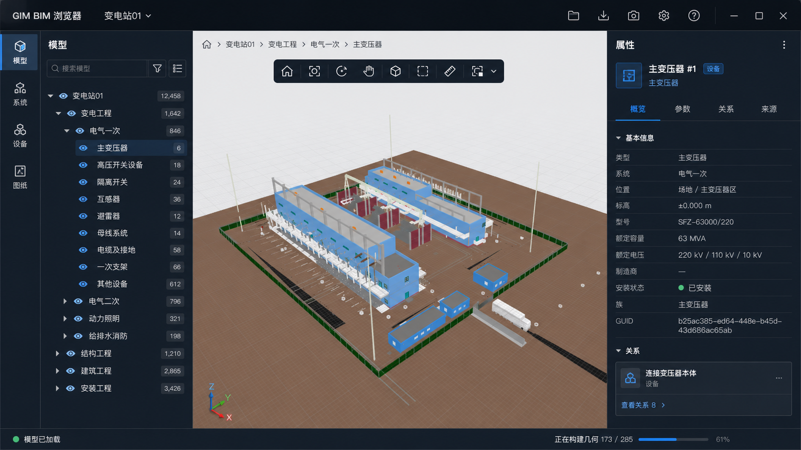

# GIM BIM 浏览器设计系统

> 版本：1.0  
> 日期：2026-08-26  
> 适用范围：变电工程、输电线路工程桌面端浏览工作台  
> 设计目标：从“文件查看器”升级为“以工程对象为中心的 BIM 信息工作台”

## 1. 设计依据与边界

设计基于仓库当前 10 个匿名样本：4 个变电工程、6 个线路工程。样本来自多种导出软件，证明 IFC、STL、SCH、STD、SLD 等资源均可能缺失或呈现工具差异。因此：

- 一级信息架构必须围绕工程、空间、系统、资产和关系组织，不能围绕 CBM、DEV、PHM、MOD 文件夹组织。
- 文件名、UUID、引用键、变换矩阵等保留在“来源”视图，作为诊断与追溯信息。
- 菜单按当前工程类型和实际能力显隐；没有 SLD 的工程不显示空白“电气图”页签。
- 变电工程以 3D 模型和电气逻辑为主要视图；线路工程以路线拓扑和地理位置为主要视图。
- 效果图包含部分 BIM 标准工具设想，必须按本文的 M0、M1、M2 阶段实施，不代表当前代码已全部具备。

相关依据：

- [样本清单](../schema/00-sample-corpus.md)
- [GIM 文件角色矩阵](../schema/03-gim-file-role-matrix.md)
- [变电站层级研究](../schema/19a-substation-hierarchy.md)
- [十样本复核](../schema/22-ten-sample-verification-0824.md)
- [左侧导航信息架构 V2](./navigation_information_architecture.md)
- [变电可视化现状](../gim_substation.md)
- [线路可视化现状](../gim_powerline.md)

## 2. 核心设计原则

### 2.1 单一模型，多种业务视图

空间树、系统树、资产表、3D、地图、单线图和属性面板是同一对象图的不同投影。任何视图中的选择都应同步到其他视图，并保持稳定的对象标识。变电空间树对多 IFC 来源先按模型分组，再呈现站区/建筑/楼层；IFC 分解、开洞和端口子对象继承空间时，必须分别显示“分解继承”或“宿主继承”证据，空间边界对象显示“空间边界”证据。

### 2.2 对象优先，文件退后

用户首先看到“主变压器”“N032 杆塔”“N031—N032 档距”，而不是 UUID 文件。技术来源放到属性面板的“来源”页，支持追溯但不干扰日常浏览。

### 2.3 位置、系统、资产三条主轴

- **位置**：工程 → 区域或区段 → 子区域或耐张段 → 对象。
- **系统**：专业 → 系统 → 子系统 → 设备。
- **资产**：设备分类 → 类型 → 实例。

三条主轴的工程差异和原始节点映射见[左侧导航信息架构 V2](./navigation_information_architecture.md)：变电采用空间优先、系统补充，线路采用组成关系和拓扑顺序优先。

三条主轴共享搜索、选择、可见性和属性，不创建互不一致的孤立列表。

### 2.4 视口是主工作面

3D 或地图占据最大面积；导航和属性为可调整宽度的辅助面板。加载进度、图层、导出等功能不得永久遮挡模型。

### 2.5 渐进呈现，不阻断浏览

工程骨架先出现，几何和详细属性随后补齐。加载状态必须回答“正在做什么、完成多少、是否可以继续操作、失败了什么”。

## 3. 统一应用框架

### 3.1 1600 × 900 基准布局

| 区域 | 基准尺寸 | 可调整范围 | 作用 |
| --- | ---: | ---: | --- |
| 顶部项目栏 | 48 px | 固定 | 项目身份、工程类型、全局命令 |
| 工作区导航轨 | 52 px | 固定 | 模型/路线、系统/资产、图纸/图层、质量 |
| 左侧导航器 | 304 px | 240–480 px | 搜索、视图切换、对象树或表格 |
| 中央视口 | 剩余宽度 | 最小 520 px | 3D、地图、单线图、表格 |
| 右侧检查器 | 352 px | 300–520 px | 概览、参数、关系、来源 |
| 底部状态栏 | 28 px | 固定 | 加载、坐标、选择数、缓存状态 |

左、右面板可拖动并记忆到项目级设置。宽度不足 1180 px 时，右侧检查器以抽屉覆盖；宽度不足 900 px 时，左侧导航器切换为临时抽屉。桌面端不采用横向滚动主导航。

### 3.2 共享区域

1. **项目栏**：应用名、匿名工程名、工程类型徽标、打开、最近项目、导出、设置、帮助。
2. **工作区导航轨**：只放 4–5 个高频工作区，图标和文本同时表达。
3. **导航器**：工作区标题、搜索与筛选、视图切换、对象内容。
4. **视口**：对象面包屑、视图模式、工具条、主内容、图例或图层弹层。
5. **对象检查器**：选中对象标题、类型、数据质量、概览/参数/关系/来源。
6. **状态栏**：非阻断任务、选择状态、坐标或单位、数据源状态。

## 4. 视觉语言

采用“Graphite BIM”风格：深色外壳、低眩光面板、浅中性模型画布、克制的蓝色交互色。它保留工程软件的数据密度，但避免纯黑大块、霓虹 HUD 和营销式卡片。

### 4.1 基础色

| Token | 值 | 用途 |
| --- | --- | --- |
| color.shell | #0B1016 | 应用外壳、顶栏 |
| color.surface.1 | #111923 | 一级面板 |
| color.surface.2 | #182330 | 悬浮层、选中行 |
| color.surface.3 | #202C3A | 输入框、按钮按下态 |
| color.border | #263342 | 分隔线、表格线 |
| color.canvas | #E6EAEE | 3D 默认背景 |
| color.canvas.grid | #C8D0D8 | 3D 网格 |
| color.primary | #3A8DFF | 主操作、当前工作区 |
| color.selection | #49C6FF | 模型和地图选中对象 |
| color.success | #31C48D | 完成、数据完整 |
| color.warning | #F5B94C | 数据不全、跨越点 |
| color.danger | #F36F6F | 错误、断链 |
| color.text.1 | #F1F5F9 | 主文字 |
| color.text.2 | #A9B5C3 | 次文字 |
| color.text.3 | #7D8B9B | 辅助信息 |

模型原始材质颜色不作为 UI 状态色。选中态使用轮廓、图标和文字共同表达，不能只依赖颜色。

### 4.2 线路专题色

| 对象 | 颜色 | 线型 |
| --- | --- | --- |
| 导线 CONDUCTOR | #3B82F6 | 实线 |
| 地线 GROUNDWIRE | #94A3B8 | 实线 |
| OPGW | #31C48D | 实线 |
| 未知导线 | #9CA3AF | 点线 |
| 跨越物 | #F5B94C | 菱形标记 |
| 当前选择 | #49C6FF | 外描边 + 加粗 |
| 解析告警 | #F36F6F | 告警图标 + 文字 |

### 4.3 字体

- UI：Segoe UI、Microsoft YaHei UI、Noto Sans SC、sans-serif。
- 数值与标识：Cascadia Mono、JetBrains Mono、Consolas、monospace。
- 应用内离线运行，不依赖在线字体。
- 字号阶梯：12、13、14、16、20、24 px。
- 常规正文 13 px；树行和属性表 12–13 px；对象标题 16 px。

### 4.4 间距与形状

- 基础网格：4 px；常用间距：4、8、12、16、24。
- 树行高：30 px；紧凑表格行高：32 px；工具按钮：32 × 32 px。
- 小圆角：4 px；面板和弹层：6 px；禁止大面积 16 px 以上圆角。
- 阴影只用于浮层：0 8px 24px rgba(0, 0, 0, 0.28)。
- 动画 150–220 ms；不得让 hover 引起布局位移。

### 4.5 图标

使用同一套 20 px 线性 SVG 图标，建议 Lucide 或 Fluent 风格。禁止 Emoji、混用实心与线性图标、用字母代替常用工具。所有纯图标按钮必须有 tooltip 和可访问名称。

## 5. 层级、选择与可见性

### 5.1 树行结构

树行从左到右依次为：

1. 展开箭头；
2. 可见性图标；
3. 对象类型图标；
4. 业务名称；
5. 数量或状态徽标；
6. 行尾上下文菜单。

UUID、扩展名和长路径不进入默认名称。名称歧义时使用业务后缀，如“辅助构筑物（含基础、结构等）”。

### 5.2 选择语义

- 单击：选择并更新属性。
- 双击：选择并在当前视图中定位。
- <kbd>Ctrl</kbd> / <kbd>Shift</kbd>：追加或区间选择。
- <kbd>Esc</kbd>：清除选择。
- <kbd>F</kbd>：聚焦选择。
- <kbd>H</kbd>：隐藏选择。
- <kbd>Shift</kbd> + <kbd>H</kbd>：隔离选择。
- 右键：聚焦、隔离、隐藏、显示同类、复制标识、查看来源。

树、3D、地图、单线图和属性面板必须共享 selectionId，不允许各自维护互不一致的选中状态。

### 5.3 可见性语义

- 眼睛：自身可见。
- 半眼睛：部分子节点可见。
- 斜线眼睛：隐藏。
- 空心眼睛：几何尚未加载。
- 告警点：引用断链或无法渲染。

## 6. 属性与关系

对象检查器固定四个页签：

| 页签 | 内容 |
| --- | --- |
| 概览 | 业务名称、类型、位置、系统、数据质量、核心参数 |
| 参数 | FAM 设计参数、DEV 设备参数、IFC 属性集、单位 |
| 关系 | 父子、所属系统、相邻对象、设备—模型—图纸映射 |
| 来源 | CBM/DEV/FAM/PHM/MOD/IFC 路径、GUID、原始键值、变换矩阵 |

属性键优先显示中文业务名，原始键作为辅助文本。空值默认隐藏，可由“显示空值”开启。长 UUID 支持复制，不强制换行占满面板。

## 7. 状态与反馈

| 状态 | 表达方式 |
| --- | --- |
| 初始空态 | 最近项目 + 打开 GIM 主操作 + 支持格式说明 |
| 工程骨架加载 | 导航树骨架屏，视口保持可操作 |
| 几何编译 | 底部任务进度，显示完成数和失败数 |
| 部分几何失败 | 对象级告警标记，可重试失败项 |
| 缓存命中 | 状态栏短提示，不弹阻断对话框 |
| 搜索无结果 | 保留查询与筛选，给出清除按钮 |
| 地图底图不可用 | 保留线路叠加层，提示已回退 Canvas |
| SLD 不存在 | 不显示图纸工作区，来源页说明样本未提供 |

Toast 仅用于短暂确认；长任务进入任务中心。错误提示必须包含对象、原因和可执行下一步。

## 8. 可访问性与输入

- 所有操作可通过键盘到达，Tab 顺序与视觉顺序一致。
- 聚焦使用 2 px 的 color.primary 外环；鼠标点击不强制显示焦点环。
- 正文对比度至少 4.5:1，重要文本至少 7:1。
- 不用红绿颜色单独表达质量；同时提供图标与文本。
- 尊重 prefers-reduced-motion。
- 面板拖动条至少 8 px 命中宽度；工具按钮最小命中区域 32 × 32 px。
- 树节点使用 tree、treeitem、group 语义；属性页签使用 tablist、tab、tabpanel。

## 9. 从当前 UI 到新 UI 的映射

| 当前入口 | 新位置 | 说明 |
| --- | --- | --- |
| 打开 GIM 文件 | 顶部项目栏“打开” | 保留为主操作 |
| 打开 IFC 文件 | 打开菜单“附加 IFC” | 降为高级操作 |
| 清空场景 | 项目菜单“关闭工程” | 使用业务语义 |
| 缓存管理 | 设置 → 存储与缓存 | 不占据高频工作面 |
| 层级树 | 模型/路线工作区 | 按业务视角重组 |
| 文件设备 | 设备工作区 + 关系页 | 文件映射退到来源 |
| 模型列表 | 图层/可见性管理器 | 表达显示控制 |
| 电气图 | 图纸工作区 | 仅实际存在时显示 |
| 截图、CSV | 视口工具栏“导出”菜单 | 与当前视图绑定 |
| 属性抽屉 | 固定可调整对象检查器 | 四页签统一结构 |

## 10. 实施阶段

### M0：信息重排，不新增解析能力

- 新应用框架、工程类型菜单、对象树、属性四页签。
- 复用当前 3D、地图、SLD、搜索、导出、缓存和选择联动能力。
- 所有缺失能力按工程实际显隐。

### M1：标准 BIM 浏览工具

- 可见性状态、隔离、显示全部、框选、测量、剖切盒。
- 资产表与树共享选择。
- 任务中心、失败对象重试、项目级布局记忆。

### M2：跨视图协同

- 3D 与单线图分屏联动。
- 线路纵断面和三维线路视图。
- 质量问题、批注、比较和可追溯变更。

## 11. 效果图

### 变电工程

### 线路工程

效果图用于信息架构、视觉密度和布局评审；实施时以本文 token、组件状态和实际数据能力为准。
