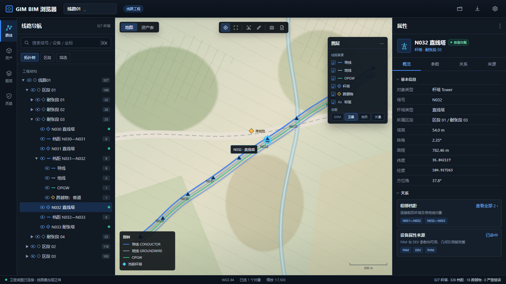

# 线路工程菜单设计简报

> 适用工程：GIMPKGT  
> 主要视图：路线地图、资产表、未来纵断面/三维线路  
> 核心目标：围绕“线性位置 + 拓扑关系 + 资产实例”浏览线路，而不是把 F1–F4 和引用文件直接铺给用户

> **V2 信息模型基准**：本简报的主树、拓扑推断、计数口径和退化规则以[左侧导航信息架构 V2](./navigation_information_architecture.md)为准；本文件补充地图工作区和交互细节。

## 1. 用户任务

1. 从全线快速定位区段、耐张段、杆塔、档距和跨越物。
2. 在路线树与地图之间双向定位。
3. 区分导线、地线、OPGW 和未知线型，查看档距、弧垂相关参数及端点。
4. 查看杆塔型号、高度、转角、坐标、FAM/DEV 命中状态。
5. 识别坐标缺失、属性缺失、引用断链和底图不可用等质量问题。
6. 导出当前地图截图、资产属性和质量问题。

## 2. 业务对象模型

线路工程使用“组成关系 + 拓扑顺序”链；资产分类、图层和质量是平行视图，不复制路线对象：

~~~text
线路工程
└─ 线路（名称/编号）
   └─ 区段 → 耐张段
      └─ 有序对象序列
         ├─ 杆塔
         ├─ 档距
         │  ├─ 导线 / 地线 / OPGW
         │  └─ 跨越物
         └─ 下一座杆塔
~~~

一个线路样本包含 9,276 个 CBM 原始节点，但业务对象仅有 129 个塔位、2,232 个导线段和 44 个跨越物；因此 F1System、F2System、F3System、F4System、TOWER、WIRE、CROSS 等原始实体名只在来源页展示。默认名称应使用线路编号、塔号、档距端点和跨越物业务名称。

## 3. 顶部项目栏

| 区域 | 内容 |
| --- | --- |
| 产品身份 | GIM BIM 浏览器 |
| 项目选择器 | 线路01、最近工程、打开 GIM、关闭工程 |
| 工程类型 | 线路工程徽标 |
| 当前视图 | 地图、资产表；纵断面/三维按实现阶段显示 |
| 全局命令 | 导出、设置、帮助 |

地图截图和 CSV 属于当前视图的导出，放在视口工具条；工程级诊断包放在顶栏导出菜单。

## 4. 左侧工作区导航

### 4.1 路线

默认工作区。导航器显示线路拓扑树：

~~~text
线路工程
└─ 线路 01
   ├─ 区段 01（起点—终点）
   │  ├─ 耐张段 01（N001—N012）
   │  │  ├─ N001 杆塔
   │  │  ├─ 档距 N001—N002
   │  │  │  ├─ 导线
   │  │  │  ├─ 地线
   │  │  │  └─ 跨越物 · 道路
   │  │  ├─ N002 杆塔
   │  │  └─ …（按顺序惰性生成）
   │  └─ 耐张段 02（…）
   └─ 待关联跨越物（仅有时出现）
~~~

树默认展开到区段、折叠到耐张段，避免一次显示数千节点。展开耐张段后按线路顺序生成杆塔和档距行；档距的导线、地线、OPGW 和跨越物作为子项。塔型/坐标质量、长度、导线数、分裂数和来源路径不放在行内，选择对象后在右侧属性面板查看；树行只保留业务标签和必要的短状态。

如果样本没有显式区段或耐张段，仅在有足够塔号、坐标和顺序证据时生成带“推断”徽标的分组；否则使用“未分段对象”，不按文件目录臆造层级。

#### 搜索

支持塔号、设备名称、杆塔类型、区段名称和坐标。搜索结果按“杆塔 / 档距 / 跨越物”分组，点击结果同步树、地图和属性。

#### 快速跳转

在搜索框旁提供“上一塔 / 下一塔”和“输入塔号定位”。批量巡检时无需反复展开树。

### 4.2 资产

提供分类树与资产表：

| 分类 | 典型字段 |
| --- | --- |
| 杆塔 | 塔号、塔型、高度、转角、经纬度、高程、质量 |
| 档距 | 起止塔号、长度、导线数、地线数、OPGW 数 |
| 导地线 | 线型、分裂数、K 值、跳线状态、端点 |
| 金具/绝缘子 | 名称、类型、所属杆塔、几何状态 |
| 跨越物 | 名称、类型、位置、所属档距 |

资产表和地图共享选择。表格筛选结果可作为临时地图图层，并支持 CSV 导出。

`WIRETYPE` 由 WIRE→DEV→FAM 链解析；未命中时进入“线型未识别”。`KVALUE`、跳线候选和分裂数是属性/过滤条件，不增加路线树层级。

### 4.3 图层

图层工作区用于长期配置；视口右上角保留高频快速弹层。

#### 业务图层

- 导线 CONDUCTOR；
- 地线 GROUNDWIRE；
- OPGW；
- 未知导线；
- 杆塔；
- 跨越物；
- 标签。

#### 底图

- OSM；
- 天地图卫星；
- 天地图地形；
- 天地图矢量；
- 纯色 Canvas 回退。

在线底图不可用时只切换底图层，GIM 线路叠加层、选择和属性必须继续工作。

### 4.4 质量

将现有统计和未解析引用从隐藏摘要提升为可操作的质量工作区。

| 分组 | 条件 | 操作 |
| --- | --- | --- |
| 坐标缺失 | 塔位或跨越物无 BLHA | 定位树节点、导出 |
| 属性不全 | FAM 或 DEV 未命中 | 查看来源、复制引用 |
| 导线异常 | 缺端点、未知线型、参数不全 | 定位档距、导出 |
| 引用断链 | CBM/DEV/FAM/PHM/MOD/STL 未解析 | 展开引用链 |
| 底图状态 | 在线底图回退 | 重试或切换底图 |

质量状态必须同时使用图标、文字和计数，不只使用颜色。

## 5. 中央视口菜单

### 5.1 视图模式

| 模式 | 阶段 | 说明 |
| --- | --- | --- |
| 地图 | M0 | 默认，复用 MapLibre + Canvas overlay |
| 资产表 | M0/M1 | 全屏表格，与地图共享筛选和选择 |
| 纵断面 | M2 | 按里程展示地形、塔高、导线弧垂、跨越 |
| 三维线路 | M2 | 独立线路 Viewer，加载 MOD/STL 和悬链线 |

未实现的视图不得显示为可点击按钮。需要预告时放入帮助文档，不在生产菜单中放禁用占位。

### 5.2 地图工具条

| 组 | 工具 | 阶段 |
| --- | --- | --- |
| 定位 | 适配全线、定位选择、回到上次范围 | M0 |
| 选择 | 点选、框选、清除 | 点选 M0；框选 M1 |
| 测量 | 距离、路径长度 | M1 |
| 图层 | 快速图层、底图切换 | M0 |
| 输出 | 截图、CSV、复制坐标 | M0 |

工具条靠近视口上边缘，不与图层弹层重叠。截图和 CSV 使用带文字的导出菜单，避免两个无上下文按钮漂浮在左上角。

### 5.3 图层快速弹层

弹层按“线路要素 / 标注 / 底图”分组：

~~~text
线路要素
[✓] 导线   [✓] 地线   [✓] OPGW
[✓] 杆塔   [✓] 跨越物

标注
[✓] 塔号   [ ] 高程   [ ] 档距

底图
OSM | 卫星 | 地形 | 矢量 | 纯色
~~~

图层状态持久化到项目设置。标签在缩放不足时自动隐藏，并在图层说明中提示，避免用户误认为数据丢失。

### 5.4 地图图例

图例只显示当前开启且实际有数据的类型。线型、颜色和点符号与现有业务语义一致：

- 蓝色实线：导线；
- 灰色实线：地线；
- 绿色实线：OPGW；
- 橙色菱形：跨越物；
- 蓝色杆塔：直线塔；
- 红色杆塔：耐张/转角塔；
- 青色外圈：当前选择。

## 6. 右侧对象检查器

### 6.1 杆塔

**概览**：塔号、塔型、区段、耐张段、经纬度、高程、方位角、高度、转角、数据质量。  
**参数**：FAM/DEV 参数、基础参数、字符串挂点。  
**关系**：前后杆塔、相邻档距、导地线、子设备、跨越物。  
**来源**：CBM/DEV/FAM/PHM/MOD/STL 引用和原始 BLHA。

### 6.2 档距或导线

**概览**：起止塔号、档距、线型、分裂数、跳线、K 值、端点。  
**参数**：WIRE 语义、FAM/DEV 参数、悬链线审计字段。  
**关系**：前后塔、同档地线/OPGW、跨越物。  
**来源**：原始 POINT0/POINT1、WIRETYPE、引用文件。

### 6.3 跨越物

**概览**：名称、类型、坐标、所属档距、数据质量。  
**关系**：相邻杆塔、相关导线。  
**来源**：CROSS 节点和 CODE 业务映射。

## 7. 树、地图、表格联动

| 操作 | 树 | 地图 | 检查器 |
| --- | --- | --- | --- |
| 点击树中杆塔 | 选中行 | 聚焦并高亮塔位 | 显示杆塔 |
| 点击地图塔位 | 展开并选中对应路径 | 高亮 | 显示杆塔 |
| 点击地图导线 | 选中所属档距或生成临时结果 | 高亮线段 | 显示导线 |
| 点击资产表行 | 选中对应路径 | 聚焦对象 | 显示对象 |
| 选择耐张段 | 选中节点 | 适配其全部塔位 | 显示摘要 |

所有定位失败都应退化为“仍显示属性”，不得因为缺坐标而清除选择或报阻断错误。

## 8. 数据质量表达

沿用并扩展当前 full、partial、coords-only 分级：

| UI 名称 | 条件 | 表达 |
| --- | --- | --- |
| 数据完整 | 坐标 + FAM + DEV 命中 | 绿色检查图标 |
| 部分属性 | 有坐标，FAM 或 DEV 缺失 | 黄色告警图标 |
| 仅坐标 | 只有 BLHA | 灰色信息图标 |
| 无法定位 | 缺 BLHA | 红色定位告警 |
| 引用异常 | 引用断链 | 红色链路告警 |

质量徽标可点击，直接打开“质量”工作区并套用对象筛选。

## 9. 当前代码迁移建议

| 现有模块 | 新组件 |
| --- | --- |
| lineProjectView.ts | PowerlineWorkspaceController |
| lineMapView.ts | RouteMapViewport + LayerPopover + Legend |
| lineMapBaseLayer.ts | BasemapController |
| lineProjectView.ts 搜索 | NavigatorSearch |
| 当前 CBM 树 | RouteTopologyTree |
| renderMapStats | QualityWorkspace + StatusSummary |
| 线路属性 HTML | ObjectInspector 适配器 |

M0 重点是把当前已实现的地图、搜索、图层、树联动、属性和导出重新编排，不要求先实现线路三维几何。

## 10. M0 验收标准

- 用户能在 3 次操作内从工程根定位到某个塔号。
- 树、地图、属性和资产表使用同一选中对象。
- 地图上能明确区分导线、地线、OPGW、跨越物和当前选择。
- 底图失败后仍能浏览线路叠加层，并在状态栏看到回退原因。
- 坐标、FAM、DEV、引用断链等质量问题可筛选和导出。
- 路线树按区段/耐张段/塔位/档距顺序组织，不把原始 CBM 节点直接铺满导航；搜索会自动展开目标祖先链。
- 无坐标或无法关联跨越物时对象仍保留在树和属性中，并带“无法定位/待关联”质量徽标。
- 线路工程仅保留“模型”地图工作区；不显示“设备”“图层”“图纸”等不适用的变电页签。选中杆塔后可在属性面板“来源”页签查看塔型预览。

## 11. 效果图

效果图展示路线工作区、地图、图层和杆塔检查器。纵断面、三维线路与测量工具属于后续阶段。
